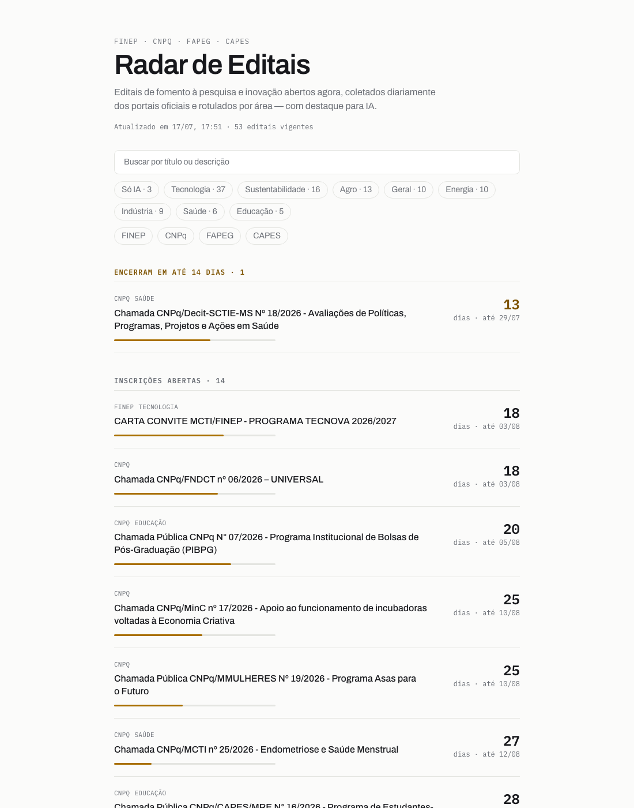

# Radar de Editais

Dashboard minimalista que agrega **editais de fomento à pesquisa e inovação** brasileiros — FINEP, CNPq, FAPEG e CAPES — em um lugar só, rotulados por área (saúde, agro, tecnologia...) e com **destaque para IA**. Atualizado automaticamente todo dia.

A ideia nasceu de uma observação em sala na UFG: professores anotam **no quadro, à mão**, os editais com prazo próximo. Este projeto substitui o quadro por um robô.



## Como funciona

```
GitHub Actions (cron diário às 07h de Brasília)
  └─ npm run scrape
       ├─ scraper/fontes/finep.ts   → API JSON pública da FINEP (com prazo real e público-alvo)
       ├─ scraper/fontes/cnpq.ts    → chamadas abertas + página de cada chamada (descrição)
       ├─ scraper/fontes/fapeg.ts   → tabela de abertas + PDF de cada edital (prazo do CRONOGRAMA)
       ├─ scraper/fontes/capes.ts   → página de editais e resultados (gov.br)
       ├─ scraper/classificador.ts  → rótulos por área + flag IA (palavras-chave)
       └─ data/editais.json         → commitado no repo se mudou
  └─ push → Vercel redeploya o site estático
```

Sem banco de dados, sem servidor, custo zero. Se uma fonte falhar (site fora do ar, layout mudou), os dados da última coleta boa daquela fonte são preservados e o rodapé do site avisa — uma fonte quebrada nunca apaga dados.

## Rodar localmente

```bash
npm install
npm run scrape   # coleta os editais e grava data/editais.json
npm run dev      # abre o dashboard em http://localhost:3000
npm test         # testes dos parsers (offline, contra fixtures reais)
```

## Deploy (uma vez)

1. Importe este repositório na [Vercel](https://vercel.com/new) (framework: Next.js, sem configuração extra).
2. Pronto — cada push do GitHub Actions redeploya o site com os dados novos.
3. O workflow `Atualiza editais` também pode ser disparado à mão na aba **Actions** do GitHub.

## Adicionar uma fonte nova

1. Crie `scraper/fontes/minhafonte.ts` exportando `coletar(): Promise<Edital[]>` — separe o `parse` (função pura sobre o HTML/JSON) do fetch, como nas fontes existentes.
2. Salve uma resposta real em `tests/fixtures/` e escreva testes do parse em `tests/fontes.test.ts`.
3. Adicione a fonte em `FONTES` (`scraper/schema.ts`) e no mapa `COLETORES` (`scraper/index.ts`), e o nome de exibição em `NOMES_FONTES` (`lib/editais.ts`).

## Ajustar as áreas

O dicionário de palavras-chave fica em `scraper/classificador.ts` (`AREAS` e `TERMOS_IA`). Termos são normalizados (minúsculos, sem acento) e `*` no fim casa variações da palavra (`farmac*` pega farmácia, fármaco, farmacêutica). Os rótulos exibidos ficam em `ROTULOS`.

## Aviso

Os dados são coletados automaticamente dos portais oficiais e podem conter erros ou atrasos. **Sempre confira o edital original** antes de submeter uma proposta.

A flag **IA** vem de palavras-chave (decisão de custo zero, sem LLM): um edital que só *menciona* inteligência artificial numa lista de tecnologias também acende a flag. Trate-a como "IA aparece no edital", não como "o edital é de IA".
